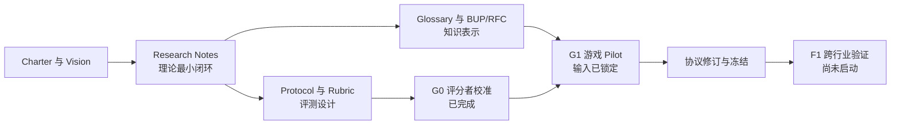

# Analytical Business Understanding

> 把资深分析师隐性的业务理解，转化为可表达、可评估、可供 AI 使用的分析知识层。

*An open research and specification project for making analytical business understanding explicit, testable, and usable by AI-assisted analytics.*

## 项目状态

| 项目项 | 当前状态 |
|---|---|
| 研究阶段 | **Phase 1 — Research Foundation** |
| 最近完成 | **G0 — Rubric calibration**，已满足探索性 G1 Pilot 的量表门禁 |
| 当前工作 | **G1 — Game pilot**，输入与运行设计已锁定，当前 15 / 45 个分析输出 |
| 正式证据 | **尚未进入 F1**；当前结果不得解释为跨行业有效性证据 |
| 规范成熟度 | Glossary、Protocol、Rubric 与 BUP 设计仍为 provisional，除非明确标记为 Frozen Decision |

## 核心问题

资深分析师的优势不仅来自 SQL、统计或工具能力，也来自他们对业务如何运行、为何变化以及应先验证什么的理解。本项目研究：

> 企业分析所依赖的业务理解是什么，能否被显式表示，并进一步被 AI 使用？

当前核心假设是：如果分析型业务理解可以被显式表示，那么获得这些知识的 AI，可能比只获得数据语义的 AI 生成更合理的业务假设、采用更短的验证路径，并形成更可信的分析结论。

完整研究动机、边界和 Phase 1 交付物见 [Project Charter](./Analytical_Business_Understanding_Project_Charter_v0.1.md) 与 [VISION.md](./VISION.md)。

## 我们正在构建什么

- **Analytical Business Understanding（ABU）**：正确解释业务现象、生成业务假设、缩小验证范围并完成分析推理所必需的最小业务知识集合。
- **Business Understanding Protocol（BUP）**：表达 ABU 的协议。
- **`BUSINESS.md`**：BUP 的第一种自然语言参考实现。
- **Transition**：当前候选核心表达单元；它仍是待研究和实验验证的工作假设，而不是既定结论。

术语定义以 [GLOSSARY.md](./GLOSSARY.md) 为准；仍未解决的定义、方法和治理问题集中记录在 [OPEN_QUESTIONS.md](./OPEN_QUESTIONS.md)。

## 研究与验证路径



执行顺序和证据门禁由 [DR-0001](./docs/decisions/DR-0001-phase-1-execution-sequence.md) 规定；Benchmark 的配对、盲评设计见 [DR-0002](./docs/decisions/DR-0002-benchmark-preregistration-design.md)。

## 当前证据：G0 评分者校准

G0 使用不进入正式 Benchmark 的材料检查评分量表是否可执行、评分者是否能稳定应用评分锚点：

- 4 个非 Benchmark 案例，12 个匿名回答；
- 2 名独立、空白上下文 AI 评分者和 1 名独立裁决者；
- 9 个主要评分子维度的 ordinal Krippendorff's alpha 为 **0.929–1.000**；
- 所有评分单元的相差不超过 1 分一致率为 **100%**；
- G0-A009 的 Evidence 支持替代根因已完成独立裁决；
- 本轮运行存在已披露的 G0-only runtime metadata 偏离，因此结论只支持进入探索性 G1 Pilot。

详见 [G0 Reliability Report](./benchmark/results/g0-calibration-ai-dry-run/reliability-report.md)、[Run Manifest](./benchmark/results/g0-calibration-ai-dry-run/run-manifest.md) 和 [Calibration Package](./benchmark/calibration/)。

## 从哪里开始

| 如果你想了解…… | 建议入口 | 状态 |
|---|---|---|
| 项目为什么存在、Phase 1 做什么 | [Project Charter](./Analytical_Business_Understanding_Project_Charter_v0.1.md) · [VISION.md](./VISION.md) | Foundation |
| ABU 的定义、边界和核心假设 | [Research Notes](./research/) · [GLOSSARY.md](./GLOSSARY.md) | Draft v0.1 / Provisional |
| 当前先做什么、为什么这样排序 | [DR-0001](./docs/decisions/DR-0001-phase-1-execution-sequence.md) | Accepted |
| 如何验证 ABU 的增量价值 | [Benchmark Overview](./benchmark/) · [Protocol](./benchmark/protocol.md) | Draft Preregistration v0.2 |
| 如何评价分析回答 | [Scoring Rubric](./benchmark/scoring-rubric.md) · [Judging Form](./benchmark/judging-form.md) | Calibrated for G1 / Not Frozen |
| G0 的材料、结果和限制 | [Calibration Package](./benchmark/calibration/) · [Results](./benchmark/results/g0-calibration-ai-dry-run/) | Complete for G1 / Not for F1 |
| 尚未解决的问题 | [OPEN_QUESTIONS.md](./OPEN_QUESTIONS.md) | Active register |
| 如何参与 | [CONTRIBUTING.md](./CONTRIBUTING.md) | Project rules |

## Phase 1 路线图

- [x] 建立项目治理、术语表和开放问题登记；
- [x] 完成 RN-0001、RN-0004、RN-0002、RN-0003 的第一轮理论草案；
- [x] 建立 Benchmark Protocol、Scoring Rubric 和 Judging Form 预注册草案；
- [x] 完成 G0 独立评分者校准，并解锁探索性 G1 量表门禁；
- [ ] 起草 BUP RFC 与 `BUSINESS.md` 最小规范；
- [ ] 完成 G1 游戏案例端到端 Pilot；
- [ ] 根据 G1 结果修订理论、表示协议和评测协议；
- [ ] 冻结 F1 所需的模型、Prompt、MID、护栏、功效和角色隔离设计；
- [ ] 运行 F1 跨行业验证并形成 Phase 1 研究总结。

## 范围边界

Phase 1 的目标是定义和验证 ABU 是否可以成为独立、合理且有效的分析知识表示层。当前仓库：

- **不会**开发 Agent Runtime、Reasoning Engine、图数据库、可视化编辑器或企业产品；
- **不会**把 G0/G1 结果外推为真实企业或跨行业有效性；
- **不会**预设 `BUSINESS.md` 或 Transition 是唯一、最佳或普适表示；
- **不会**把更长文本、术语复用或隐藏答案相似度误当成 ABU 的增量价值。

## 仓库结构

```text
.
├── research/              # ABU 的理论定义、性质、边界与反例
├── rfcs/                  # BUP 与 BUSINESS.md 规范草案
├── references/            # 游戏、电商、外卖、SaaS、广告参考业务
├── benchmark/             # 协议、量表、校准材料和实验结果
└── docs/
    ├── architecture/      # 概念与文档架构
    ├── diagrams/          # 可复用图示
    └── decisions/         # Decision Records
```

## 参与和治理

研究主张、规范要求和工程实现必须保持可追踪；未验证观点需标记为 Hypothesis、Open Question 或 Draft Decision，重要修改通过 Decision Record 记录。提交前请阅读 [CONTRIBUTING.md](./CONTRIBUTING.md)。

本项目尚未选择开源许可证；在 `LICENSE` 明确之前，仓库公开可见不等同于授予使用、修改或分发许可。
